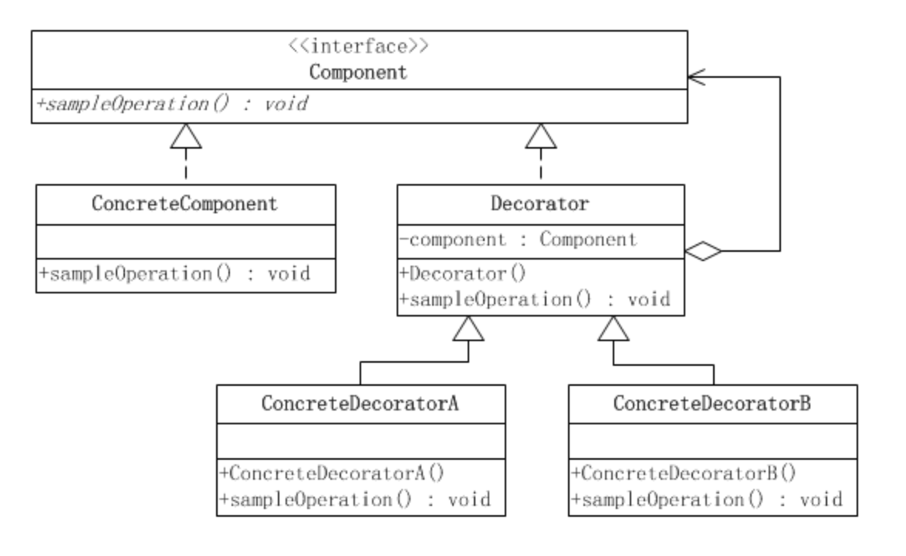
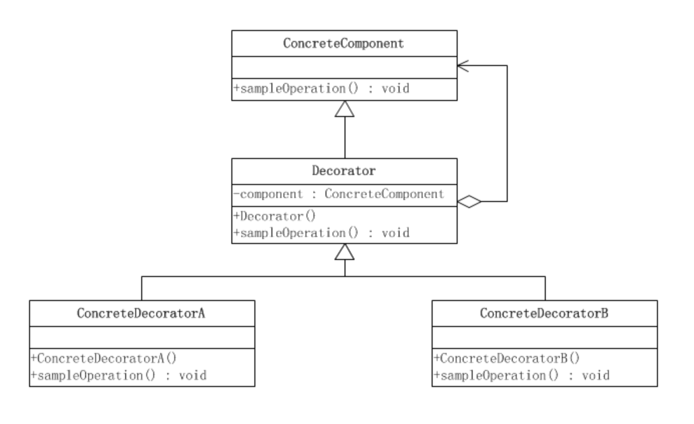
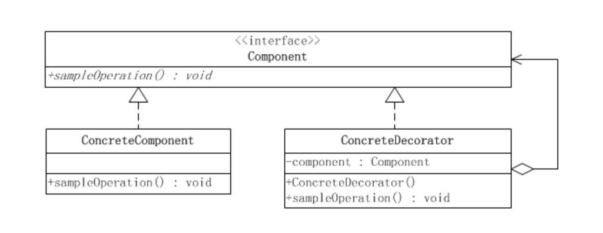
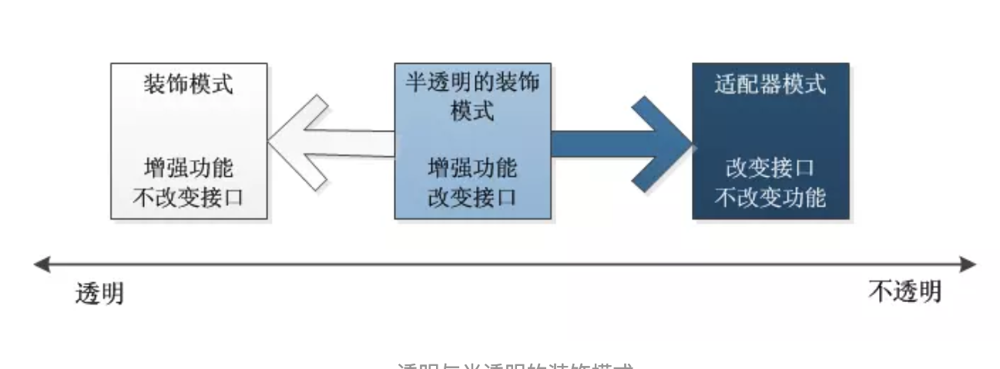

 **目的**
 
  动态地给一个对象添加一些额外的职责。就增加功能来说Decorator 模式相比生成子类更为灵活。  
 
 **适用性**
 
  • 在不影响其他对象的情况下，以动态、透明的方式给单个对象添加职责。  
  • 处理那些可以撤消的职责。  
  • 当不能采用生成子类的方法进行扩充时。一种情况是，可能有大量独立的扩展，为支持每一种组合将产生大量的子类，使得子类数目呈爆炸性增长。
    另一种情况可能是因为类定义被隐藏，或类定义不能用于生成子类。  

**优点**
 
  1. 比静态继承更灵活与对象的静态继承 (多重继承)相比，Decorator模式提供了更加灵活的向对象添加职责的方式;  
  2. 避免在层次结构高层的类有太多的特征, Decorator模式提供了一种 “即用即付” 的方法来添加职责。它并不试图在一个复杂的可定制的类中支持所有可预见的特征，相反，你可以定义一个简单的类，并且用Decorator类给它逐渐地添加功能;  

**缺点**
  
  1. 装饰器与它的被装饰组件不一样 装饰器是一个透明的包装。如果我们从对象标识的观点出发，一个被装饰了的组件与这个组件是有差别的，因此使用装饰时不应该依赖对象标识。  
  2. 有许多小对象  采用装饰器模式进行系统设计往往会产生许多看上去类似的小对象，这些对象仅仅在他们相互连接的方式上有所不同，
  而不是它们的类或是它们的属性值有所不同。尽管对于那些了解这些系统的人来说，很容易对它们进行定制，但是很难学习这些系统，排错也很困难。  
  
  
 **类结构图**
 
   

大多数情况下，装饰模式的实现都要比上面的结构要简单。
如果只有一个ConcreteComponent类，那么可以考虑去掉抽象的Component类(接口)，把Decorator作为一个ConcreteComponent的子类。如下图所示：  

  
  
  
  如果只有一个ConcreteDecorator类，那么就没有必要建立一个单独的Decorator类，而可以把Decorator和ConcreteDecorator的责任合并成一个类。甚至在只有两个ConcreteDecorator类的情况下，都可以这样做，如下图所示：  
  
   
   
  **透明性的要求** 
   
  装饰模式对客户端的透明性要求程序不要声明给一个ConcreteComponent类型的变量，而应当声明一个Component类型的变量。  
  然而，纯粹的装饰模式很难找到。装饰模式的用意是在不改变接口的前提下，增强所考虑的类的性能。在增强性能的时候，往往要建立新的公开的方法。  
  这就导致了大多数的装饰模式的实现都是“半透明”的，而不是完全透明的。换而言之，允许装饰模式改变接口，增加新的方法。这意味着客户端可以声明ConcreteDecorator类型的变量，从而可以调用ConcreteDecorator类中才有的方法：  
  半透明的装饰模式是介于装饰模式和适配器模式之间的。适配器模式的用意是改变所考虑的类的接口，也可以通过改写一个或几个方法，或增加新的方法来增强或改变所考虑的类的功能。大多数的装饰模式实际上是半透明的装饰模式，这样的装饰模式也称作半装饰、半适配器模式。  
  
   
   
   